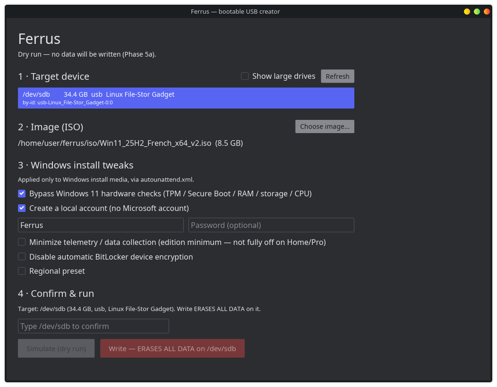
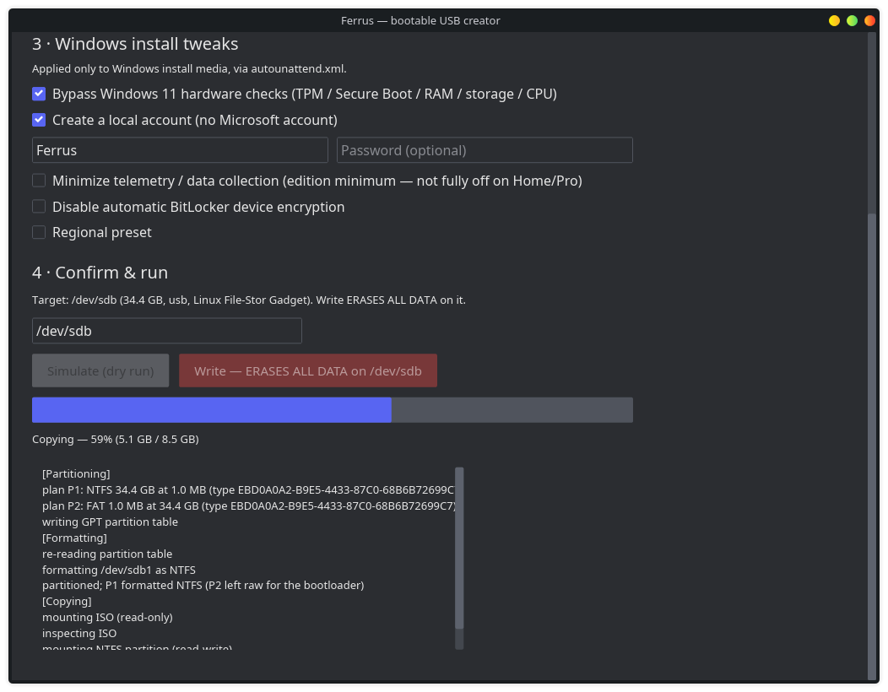

# Ferrus

**A bootable-USB creator for Linux, with the Windows-install tweaks Rufus users
miss.** Written in Rust.

[](LICENSE)
[](https://github.com/cdhdt/ferrus/actions/workflows/ci.yml)

On Linux there is no obvious way to build a Windows 11 install stick that also
does the Rufus things — get past the TPM / Secure Boot checks and skip the
Microsoft-account requirement — without booting into Windows or hand-editing
answer files. Ferrus fills that gap: it writes any ISO, and it turns a Windows 11
ISO into an install stick with those tweaks applied, from a CLI or a GUI. It is
**Linux-first** (a clean-room successor to Rufus, not a port), designed
cross-platform from day one.

## Features

- **Safe target selection.** Devices are eligible by *transport* (USB/MMC), not
  the unreliable `removable` sysfs bit; the system disk and critical mounts are
  filtered out and refused in code. Every destructive operation passes a single,
  typed checkpoint (`SafeTarget`), and `--dry-run` works everywhere.
- **Raw ISO write.** Byte-for-byte write of any already-bootable image
  (`ferrus write`), with `O_EXCL`, `fsync`, and optional read-back `--verify`.
- **Windows 11 install media.** GPT with an NTFS main partition (Windows
  `install.wim` exceeds FAT32's 4 GB limit) plus a FAT helper carrying the
  **Secure Boot-signed UEFI:NTFS** loader, so UEFI firmware can boot the NTFS
  partition. The ISO is copied verbatim.
- **`autounattend.xml` tweaks** (file drops, not binary patching), each verified
  against current sources and parameterized by the options you pick:
  - bypass the Windows 11 hardware checks (TPM / Secure Boot / RAM / storage / CPU);
  - create a **local account** without a Microsoft account;
  - **minimize telemetry** — reduced to the edition minimum (Required/Basic on
    Home/Pro; only Enterprise/Education honor "off") plus advertising ID / location
    / Find My Device / feedback off. This is **minimized, not fully off** on
    Home/Pro — see Security;
  - disable **automatic BitLocker** device encryption;
  - optional **regional** preset (language / locale / keyboard).
- **Windows-vs-generic detection**, unprivileged and without mounting: a
  read-only UDF/ISO9660 probe used as a hint (the mounted-ISO check remains the
  authority at write time).
- **GUI, never root.** The graphical front-end (iced) runs unprivileged; the real
  write goes through a **type-to-confirm** gate, then a minimal **polkit-elevated
  helper** that re-validates everything on the root side and streams live progress
  back.

## Screenshots

> Screenshots are not committed yet. Please add them under `docs/screenshots/`.
> Capture them with **`ICED_BACKEND=tiny-skia ferrus-gui`** (CPU rendering) so the
> images are pixel-correct — the default `wgpu` backend can render text badly on
> some GPUs and must not be used for the screenshots.

- `docs/screenshots/select.png` — device + ISO chosen, Windows tweaks ticked.
- `docs/screenshots/write.png` — a write in progress, live progress bar.
- `docs/screenshots/dryrun.png` — a dry-run plan (what a real write would do).

<!--  -->
<!--  -->

## Requirements

Runtime tools Ferrus shells out to (install what your distro calls them):

- `sfdisk` and `partprobe` — partitioning + kernel re-read (**util-linux** /
  **parted**);
- `mkfs.ntfs` — format the NTFS partition (**ntfs-3g** / **ntfsprogs**);
- an NTFS read-write driver — kernel **`ntfs3`** (Linux ≥ 5.15) *or* **`ntfs-3g`**
  (FUSE);
- `mount` / `umount` (**util-linux**); `udevadm` is used (best-effort) to settle
  device nodes;
- **polkit** (`pkexec`) — only for the GUI's privileged helper.

The GUI additionally needs a desktop session with a **polkit agent** and an
**xdg-desktop-portal** backend (for the native file picker). Building from source
needs a Rust toolchain with **edition 2024** (Rust ≥ 1.85); building the GUI on
Linux needs `libxkbcommon-dev` and `libgtk-3-dev` (the list from iced's own CI).

## Installation

A plain install target (not distro packaging) sets Ferrus up the way an end user
runs it — the GUI unprivileged, elevating a small **root-owned helper** through
**named polkit actions**:

```sh
sudo make install      # release build + install
sudo make uninstall    # remove everything
```

It installs `ferrus` + `ferrus-gui` → `/usr/bin/`, the privileged
`ferrus-helper` → `/usr/libexec/` (root-owned; this path is the `exec.path` of the
polkit actions, so they stay in lockstep), the polkit actions →
`/usr/share/polkit-1/actions/`, and two desktop entries → `/usr/share/applications/`:
**Ferrus** and **Ferrus (software rendering)** (the latter forces CPU rendering —
see Troubleshooting).

Once installed, `ferrus-gui` uses the installed helper and its **named** polkit
action; `$FERRUS_HELPER` is ignored, so a compromised environment cannot redirect
the GUI. For development, don't install and point the GUI at your build:
`FERRUS_HELPER=target/debug/ferrus-helper cargo run -p ferrus-gui`.

## Usage

CLI (`--dry-run` on any command prints the plan and touches nothing):

```sh
# list plausible target devices (add --all to include large USB volumes)
ferrus list

# raw-write an already-bootable ISO, then read it back to verify
sudo ferrus write --image alpine.iso --target /dev/sdX --verify

# build a Windows 11 install stick with tweaks
sudo ferrus prepare-windows --target /dev/sdX --image Win11.iso \
     --bypass-hardware \
     --local-account me --local-password 'secret' \
     --minimize-telemetry --disable-auto-bitlocker --region fr-FR \
     --verify
```

GUI: launch `ferrus-gui` (or the **Ferrus** menu entry). Pick a device and an
ISO, tick the tweaks, **type the exact device path** to unlock the action, and
choose *Simulate* (dry-run) or *Write*.

## How it works

- Modern Windows ISOs ship `install.wim` (> 4 GB), which does not fit on FAT32, so
  the install partition is **NTFS**. UEFI can't boot NTFS by itself, so a tiny FAT
  helper partition carries **UEFI:NTFS** (pbatard) — a small signed EFI loader that
  chains into the NTFS partition.
- The tweaks are **file drops**: an `autounattend.xml` at the media root (Windows
  Setup reads it automatically) plus LabConfig registry keys. No image is patched.
  The `autounattend.xml` generator, parameterized by the ticked options, is the
  core of the project. Values that drift per Windows build are isolated in a
  per-build profile and dated against their sources.

## Status

Ferrus is validated on **real hardware, through Windows 11 25H2**:

- safe enumeration + refusal exercised on a real host;
- a generic ISO (Alpine) written raw and booted;
- a real Windows 11 25H2 ISO written (copy byte-identical to the source, 8.5 GB,
  `install.wim` > 4 GB on NTFS) and booted to Windows Setup via the signed
  UEFI:NTFS loader;
- on a real 25H2 install: **no TPM wall** (hardware bypass), **local account
  created without a Microsoft account**, and — in a TPM 2.0 + Secure Boot VM — **no
  automatic BitLocker**;
- the **GUI's destructive path** end to end: after `sudo make install`, clicking
  *Write* raised the **named** polkit action (the "…ERASES ALL DATA…" dialog, not
  the generic one), and the real write streamed a **live progress bar** without
  freezing the window.

The engine ships with unit tests (including the refusal cases) and CI runs
`fmt` + `clippy -D warnings` + tests on every push.

**Not done / limits:**

- **Linux only.** Windows and macOS are on the roadmap; the code is
  platform-abstracted (traits + `cfg`) but only the Linux backend is implemented.
- **UEFI/GPT only** — no legacy BIOS boot.
- **No distro packaging** yet (no `.deb`/Flatpak); `make install` is the path.
- Per-user (HKCU) privacy toggles (tailored experiences, inking/typing) are
  deferred — they need the Default-user hive, not a specialize-pass reg-add.

## Security

- The GUI runs **unprivileged**. Only a small `ferrus-helper` runs as root, via
  polkit; it **re-validates every input on the root side** (re-enumerates and
  re-runs the `SafeTarget` checkpoint — it never trusts the device path the GUI
  proposes), reads its request on stdin (so a password never appears in argv or
  the environment), accepts exactly two subcommands, and hardcodes
  destructiveness per subcommand (`dry_run` is never request data). The whole
  workspace is `#![forbid(unsafe_code)]`.
- **The local-account password is written *obfuscated*, not encrypted.** Windows'
  `autounattend.xml` stores it as `base64(UTF-16LE(password + "Password"))` —
  trivially reversible. Anyone who has the stick can recover it. This is inherent
  to the Windows unattend mechanism, not a Ferrus choice; treat a stick that
  carries a password as carrying a recoverable secret. Ferrus never logs the
  plaintext and redacts it from all diagnostics, but it cannot make an inherently
  reversible on-disk format secret.

## Troubleshooting — display / text artifacts

The GUI renders on the GPU (iced's `wgpu`) by default. On some GPUs/drivers wgpu
**initializes fine but renders corrupted text** — a driver/GPU issue Ferrus cannot
reliably auto-detect. Switch to the CPU renderer (`tiny-skia`, always compiled in):

```sh
ICED_BACKEND=tiny-skia ferrus-gui      # or use the "Ferrus (software rendering)" entry
```

Slower, but pixel-correct. `ferrus-gui` prints one startup line noting the active
backend and this workaround. (iced 0.14 has no programmatic backend switch, so it
is set via the environment variable.)

## License & credits

[GPL-3.0-or-later](LICENSE). Ferrus is a **spiritual successor to
[Rufus](https://rufus.ie/)** — a clean-room rewrite in Rust, **not a fork**. It
vendors **[UEFI:NTFS](https://github.com/pbatard/uefi-ntfs)** by Pete Batard
(pbatard), also GPLv3; see [`res/uefi/NOTICE`](res/uefi/NOTICE) for the license and
source reference.

## Roadmap

- **Phase 6** — Windows port.
- **Phase 7** — macOS port.
- Polish — per-user (HKCU) privacy toggles, distro packaging (`.deb`/Flatpak), a
  dedicated icon.

## Suggested GitHub topics

`rust` · `bootable-usb` · `usb` · `iso` · `windows` · `linux` · `polkit` ·
`iced` · `rufus`
